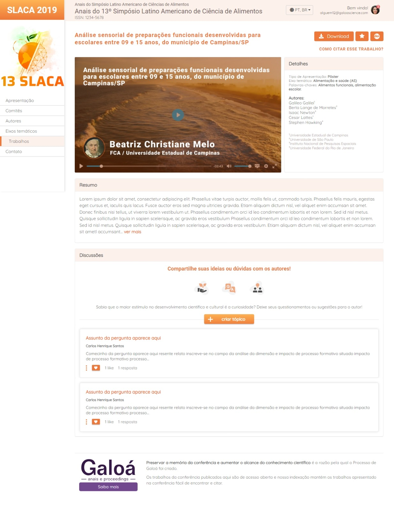

<h1 align="center"> First Exercise FrontEnd - Chuva / Galoá </h1>

### Tópicos 

- [Descrição do projeto](#descrição-do-projeto)

- [Funcionalidades](#funcionalidades)

- [Aplicação](#aplicação)

- [Ferramentas utilizadas](#ferramentas-utilizadas)

- [Acesso ao projeto](#acesso-ao-projeto)

- [Abrir e rodar o projeto](#abrir-e-rodar-o-projeto)

   

## Descrição do projeto 

 Projeto em desenvolvimento para concluir minha 2° etapa do processo seletivo para uma vaga desejável a mim! Foi uma experiência única. A empresa Chuva fez chover alegria no meu crescimento profissional, ter esse desafio foi uma continuação de muita dedicação. 
 Eu havia recebido um protótipo e fiz esse projeto com base nas informações recebidas nele. 

